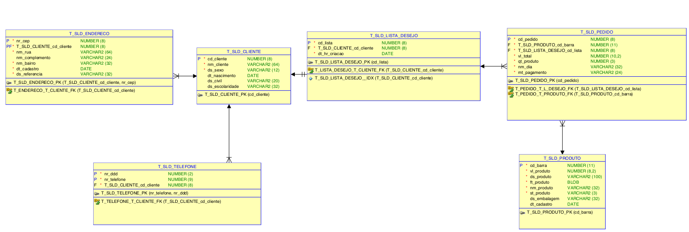

<h1>Desafio Projeto Wedo - Modelagem de Dados</h1>

<p>Atividade que pode ser acompanhada pela situação proposta pelo PDF na raiz do projeto.</p>
<br>
<p> necessário Ultilizar a ferramenta Gratuíta da <b>Oracle</b>: <u>SQL Developer Data Modeler<u>, para fazer a criação das Entidades e afins. O programa pode ser instalado pelos links a baixo:</p>
<p><a href="https://www.oracle.com/tools/downloads/sql-data-modeler-downloads.html">Windows e MAC</a></p>
<p>Para linux será necessário o SnapCraft e executar o seguinte comando:</p>

```
  sudo snap install osddm
```

<h3>O Projeto Envolve:</h3>
<ol>
  <li>Conhecimentos iniciais de Modelo conteitual, Modelo Lógico e Modelo físico de dados</li>
  <li>Boas práticas</li>
  <li>Criação de script DDL e DML</li>
<ol>
<br>
<h2>Amostra Modelo Físico</h2>


